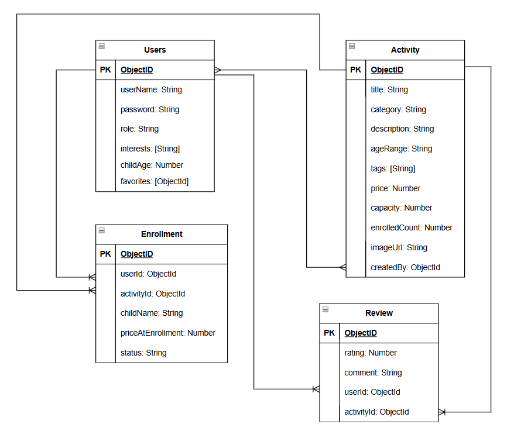

# kids-activity-finder

## Overview
Kids After-School Activity System is a full-stack web app that helps parents discover and enroll their kids in after-school activities, while giving providers a simple way to manage their offerings. Parents can browse, search, and favorite activities, leave reviews, enroll their children, and see personalized recommendations based on their interests and their child's age. Providers can add, edit, and delete activities, and keep an eye on enrollment capacity from their dashboard.

## Screenshots

## Technologies Used
1. MongoDB
2. JavaScript

## Getting Started

## Installation

## User Stories
1. As a guest, I can view all activities without signing in.
2. As a guest, I can create an account.
3. As a provider, I can sign in using a seeded account.
4. As a provider, I can add new activities.
5. As a provider, I can edit activities I manage.
6. As a provider, I can delete activities.
7. As a parent, I can leave a review (rating + comment) on an activity.
8. As a parent, I can enroll my child in an activity.
9. As a parent, I can favorite activities to save for later.
10. As a provider, I can see a low-capacity indicator on my dashboard for activities nearing full.
11. As a parent, I can search/filter activities by category or age range.
12. As a parent, I can view a "Recommended for you" section, ranked by a scoring match against my interests and my child's age.
13. As a guest, if I try to review, enroll, or favorite an activity, I'm redirected to sign in.
14. As a parent, if I try to access provider-only routes (add/edit/delete activity), I'm denied access.
15. As a parent, I can view my own enrollment history.
16. As a provider, I can view all enrollments across activities.

## Database Design

## Routes
Activities Routes

| Method | Route                | Description                       |
|--------|----------------------|-----------------------------------|
| GET    | /activities          | list all activities               |
| GET    | /activities/:id      | Show one activity and its reviews |
| GET    | /activities/new      | shows create acticity form        |
| POST   | /activities          | Create activity                   |
| GET    | /activities/:id/edit | Show edit form                    |
| PUT    | /activities/:id      | Update activity                   |
| DELETE | /activities/:id      | Delete activity                   |

Review Routes

| Method | Route                           | Description                  |
|--------|---------------------------------|------------------------------|
| POST   | /activities/:activityId/reviews | Create review on an activity |
| GET    | /reviews/:id/edit               | Show edit form, pre-filled   |
| PUT    | /reviews/:id                    | Update review                |
| DELETE | /reviews/:id                    | Delete review                |

Enrollment Routes

| Method | Route                               | Description                 |
|--------|-------------------------------------|-----------------------------|
| POST   | /activities/:activityId/enrollments | Enroll child in activity    |
| GET    | /enrollments                        | View own enrollment history |
| DELETE | /enrollments/:id                    | Cancel own enrollment       |
| GET    | /provider/enrollments               | View all enrollments        |

Home Routes
| Method | Route               | Description        |
|--------|---------------------|--------------------|
| GET    | /                   | Homepage           |
| GET    | /dashboard          | Parent dashboard   |
| GET    | /provider/dashboard | Provider dashboard |

## Features

## Future Enhancements

## Credits